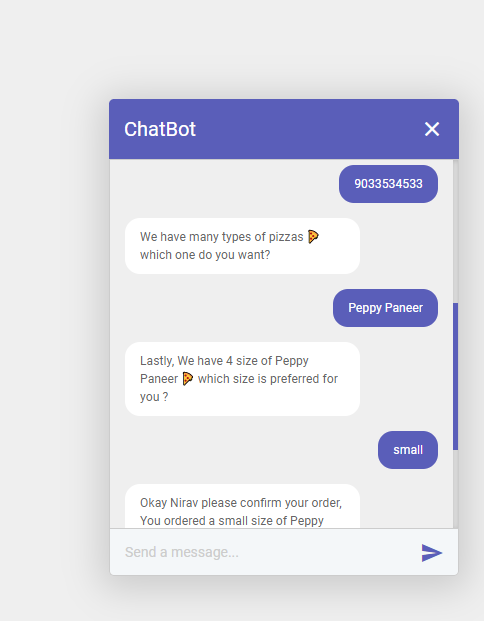

# Creating Chatbot Using Python Flask & DialogFlow

<p align="center">
  
</p>

## PREREQUISITE

Make sure you have installed the following tools.
- Download and install [**Python**](https://www.python.org/) from here as per your supported OS.
- IDE (Integrated Development Environment) [**PyCharm**](https://www.jetbrains.com/pycharm). ***`optional`***

## REQUIRED LIBRARIES
- [**Flask**](https://pypi.org/project/Flask)
```
pip install Flask
```
- [**Dialogflow**](https://pypi.org/project/dialogflow)
```
pip install dialogflow
```
### Service Account Setup
1. In Dialogflow's console, go to settings ⚙ and under the general tab, you'll see the project ID section with a Google Cloud link to open the Google Cloud console. Open Google Cloud.
2. In the Cloud console, go to the menu icon **☰ > APIs & Services > Credentials**
3. Under the menu icon **☰ > APIs & Services > Credentials > Create Credentials > Service Account Key**.
4. Under Create service account key, select New Service Account from the dropdown and enter. If you already have a service account key, select that. 
5. Give any name for the name and click Create. Give appropriate role.
6. JSON file will be downloaded to your computer that you will need in the setup sections below.

### Set up Dialogflow DetectIntent endpoint to be called from the App
1. Inside root folder, replace the key.json in the credentials folder with your own credentials json file. 
2. In app.py, Change the GOOGLE_PROJECT_ID = **"<YOUR_PROJECT_ID>"** to your project ID
